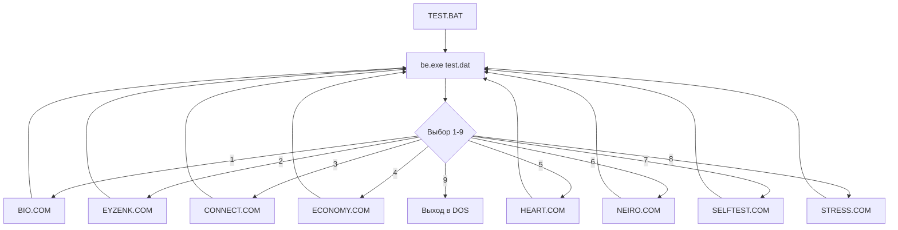
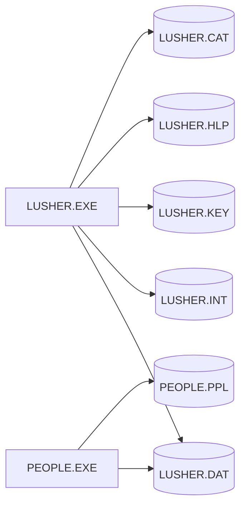

# Реверс-инжиниринг DOS-программ по психологии

## Общая архитектура

### ПСИХО (Психодиагностический пакет)

Все 8 `.COM` файлов — скомпилированные программы на **Turbo Pascal** (одинаковый рантайм, одинаковый start-код `e9 79 2c 90 cd ab 20 20`).

**Общая структура каждой программы:**
```
jmp 0x2c7c     ; прыжок мимо данных к основному коду
int 0xab       ; Turbo Pascal signature
...
[Turbo Pascal runtime + данные]
...
[Код программы]
...
[Строковые данные: название теста, параметры]
```

**Файл CODE.DAT** — внешняя база вопросов (256 записей, адресация [0..255]):
- 240 вопросов (записи 0..239 или 1..240)
- 16 служебных записей (240..255) с параметрами теста, ключами, шкалами
- В поставке отсутствует

**TEST.DAT** — скрипт для Batch Enhancer (`be.exe`), рисует меню:
- CP866 (DOS-кириллица)
- Содержит названия пунктов меню на русском
- Формат: команды `window`, `rowcol` с координатами и текстом

**TEST.BAT** — загрузчик меню:
```
be test.dat         ; отрисовка меню
be ask " " 1-9      ; ввод выбора
if errorlevel N goto LABEL  ; переход к тесту
```



### Цвета Люшера

LUSHER.EXE — MS-DOS MZ EXE, вероятно **Turbo Pascal** или **Borland C++**.

**Зависимость от файлов:**
- LUSHER.DAT — бинарная база испытуемых (записи фиксированной длины)
- LUSHER.INT — текстовый файл интерпретаций (CP866)
- LUSHER.CAT — каталог испытуемых (текстовый, CP866)
- LUSHER.KEY — ключ регистрации (113 КБ)
- LUSHER.HLP — файл справки



## Детальный анализ каждого теста

### 1. BIO.COM — Биоритмы

**Формула:** расчёт трёх синусоидальных циклов от даты рождения:
- Физический: 23 дня (`sin(2π * t / 23)`)
- Эмоциональный: 28 дней (`sin(2π * t / 28)`)
- Интеллектуальный: 33 дня (`sin(2π * t / 33)`)

**Параметры из бинарника:**
- Название: "BIO -", "The BioRhythms Test"
- Управление: `PgUp`/`PgDn` (смена даты), `Home`/`End`
- Файл создан утилитой ALIC Conversion Utility

**Логика:**
1. Запрос даты рождения
2. Расчёт количества прожитых дней
3. Вычисление фаз всех трёх циклов
4. Отображение графиков (синусоиды)
5. Интерпретация критических дней (пересечение нуля)

### 2. EYZENK.COM — Тест Айзенка (EPI)

**Методика:** Eysenck Personality Inventory (Eysenck & Eysenck, 1964)
- 57 вопросов типа "да/нет"
- Формы А и Б по 57 вопросов
- **Шкала E (Extraversion):** 24 вопроса
- **Шкала N (Neuroticism):** 24 вопроса
- **Шкала L (Lie):** 9 вопросов (контроль искренности)

**Параметры из бинарника:**
- `A=`, `B=`, `K=`, `L=`, `N=` — переменные подсчёта
- Формулы:
  - `E = A + B` (экстраверсия = форма A + форма B)
  - `N = K + L` (нейротизм)
  - `L = N` (шкала лжи, отдельно)
- Возрастные нормы: 20-30 лет

**Scoring (стандартный EPI):**
- Extraversion: 0-12 = интроверт, 13-18 = амбиверт, 19-24 = экстраверт
- Neuroticism: 0-12 = стабильный, 13-18 = норма, 19-24 = нейротичный
- Lie: >4 = недостоверный результат

### 3. CONNECT.COM — Тест на совместимость

**Методика:** оценка коммуникативных способностей и совместимости

**Параметры из бинарника:**
- `K=`, `M=` — переменные подсчёта
- Параметры: `A=`, `C=`
- Формула: `K + M` (суммарный балл)

**Шкалы (предположительно):**
- Коммуникабельность
- Эмпатия
- Гибкость в общении
- Толерантность

### 4. ECONOMY.COM — Деловая сфера

**Методика:** оценка стиля делового поведения и экономического мышления

**Параметры из бинарника:**
- Название: "ECONOMY -", "The Economy Test"
- Множественные категории подсчёта (`hE.`, `hE2`, `eE2`, `fE2`, `gE2`)

**Шкалы (предположительно):**
- Рациональность/импульсивность
- Склонность к риску
- Ориентация на результат/процесс
- Коллективизм/индивидуализм

### 5. HEART.COM — Вегетативная/сердечно-сосудистая система

**Методика:** оценка вегетативной регуляции и сердечно-сосудистых реакций

**Параметры из бинарника:**
- `IBC=`, `PPS=`, `DE=`, `AG=`, `NCD=`, `ZM=` — 6 шкал
- Числовые константы: `1-2`, `5-10`
- `ffff` и `3333` — значения для расчётов (hex float?)

**Шкалы:**
- IBC — индекс вегетативного баланса
- PPS — периферическое сосудистое сопротивление
- DE — депрессия/энергия
- AG — активность/гиперактивность
- NCD — нейро-циркуляторная дистония
- ZM — защитные механизмы

### 6. NEIRO.COM — Неврологический тест

**Методика:** скрининг неврологических симптомов и функционального состояния

**Параметры из бинарника:**
- Название: "Neiro -", "Test"
- Вероятно оценивает:
  - Утомляемость
  - Раздражительность
  - Головные боли
  - Нарушения сна
  - Координацию
  - Память и внимание

### 7. SELFTEST.COM — Самооценка

**Методика:** оценка уровня самооценки (вероятно, адаптация Rosenberg Self-Esteem Scale или Dembo-Rubinstein)

**Параметры из бинарника:**
- Название: "Self-Evaluation", "Test"
- Уровни: `!`, `"`, `#`, `%` — маркеры разных степеней самооценки
- Оценка по нескольким параметрам с последующим усреднением

### 8. STRESS.COM — Стресс

**Методика:** оценка уровня стресса (вероятно, адаптация шкалы PSM-25 или Holmes-Rahe)

**Параметры из бинарника:**
- `150` — максимальный/пороговый балл
- `4-5` — диапазон среднего стресса
- `8-9` — высокий стресс
- `1/2` — коэффициент
- `6-8` — ещё один диапазон
- `/10-15` — максимальный диапазон

**Уровни стресса:**
- 0-150: нормальный
- 150-200: умеренный
- 200+: высокий

### 9. BIORIC.EXE — Биоритмы (расширенная версия)

**Язык:** Turbo Basic (Borland, 1987)

**Отличия от BIO.COM:**
- Выходные устройства: `KYBD:SCRN:NULL:LPT1:LPT2:LPT3:COM1:COM2:`
- Возможность печати результатов
- Более детальные графики

### 10-11. LUSHER.EXE + PEOPLE.EXE — Цветовой тест Люшера

**Методика:** Max Lüscher Color Test (8-цветный вариант)

**Процедура:**
1. Испытуемому показывают 8 цветовых карточек
2. Выбрать самый приятный цвет (ранг 1)
3. Повторить для оставшихся (ранги 2-8)
4. Второй раунд — повторить всё
5. Расчёт интерпретации

**8 цветов Люшера:**
| № | Цвет | Психологическое значение |
|---|------|------------------------|
| 0 | Серый | Нейтральность, отгороженность |
| 1 | Синий | Спокойствие, удовлетворённость |
| 2 | Зелёный | Уверенность, настойчивость |
| 3 | Красный | Активность, воля |
| 4 | Жёлтый | Оптимизм, экспансивность |
| 5 | Фиолетовый | Идентификация, чувствительность |
| 6 | Коричневый | Телесный комфорт, безопасность |
| 7 | Чёрный | Отрицание, протест |

**Формат LUSHER.DAT (бинарный):**
```
Смещение 0x00: маркер записи
Смещение 0x08: дата/время (4 байта, encoded)
Смещение 0x40: первая выборка (8 байт, числа 0-7)
Смещение 0x48: вторая выборка (8 байт, числа 0-7)
Размер записи: ~200 байт
```

**Параметры интерпретации (из LUSHER.INT):**
1. Тревога (Anxiety) — % 
2. Компенсация (Compensation) — %
3. Активность (Activity) — %
4. Работоспособность (Performance) — %
5. Вегетативный тонус (Autonomic tone) — %
6. Консистентность (Consistency) — корреляция (-1..+1)

**Формулы (стандартный тест Люшера):**
- **ST (суммарная тревога):** сумма отклонений цветов на позициях 5-8
- **COI (коэффициент общей интерпретации):** комбинация факторов
- **Consistency:** Spearman rank correlation между двумя раундами
- **Anxiety %:** `ST / max_ST * 100`
- **Compensation:** основано на взаимном расположении цветов

## Формат HELP.DOC

Бинарный файл с псевдографикой DOS (CP866):
- Рамка из символов `╔═╗║╟─╢`
- Содержит справку по настройке CODE.DAT

## Примечания

1. **Кодировка:** все текстовые данные в CP866 (альтернативная DOS-кириллица)
2. **ALIC Conversion Utility:** все COM-файлы созданы этой утилитой — она, вероятно, преобразует текстовые файлы вопросов (CODE.DAT) в исполняемые COM-файлы
3. **Отсутствие CODE.DAT:** вопросы тестов не могут быть извлечены напрямую — только из бинарных строк
4. **Год создания:** 1987-1990 (даты файлов: BIO.COM — 1980 (default), HELP.DOC — 26.11.89, TEST.BAT — 19.12.89)
5. **Разработчик:** "Alic & Co" (строки во всех COM-файлах)
