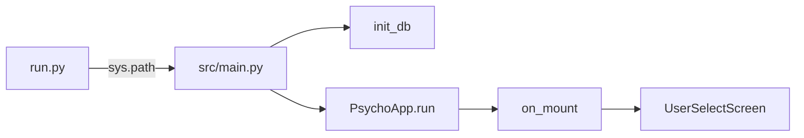
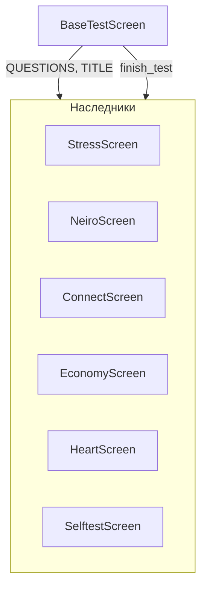
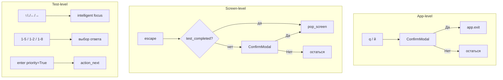

# Руководство по коду

## 1. Как всё устроено

```
run.py → src/app.py (PsychoApp)
              │
              ├── screens/
              │   ├── user_select.py   — выбор пользователя
              │   ├── user_create.py   — создание пользователя
              │   ├── main_menu.py     — список 9 тестов
              │   ├── statistics.py    — статистика (заменяет history.py)
              │   ├── result_view.py   — детальный просмотр результата
              │   ├── confirm_modal.py — всплывающее окно подтверждения
              │   │
              │   ├── _base_test.py    — базовый класс (6 тестов)
              │   │   ├── stress.py
              │   │   ├── neiro.py
              │   │   ├── connect.py
              │   │   ├── economy.py
              │   │   ├── heart.py
              │   │   └── selftest.py
              │   │
              │   ├── eysenck.py       — отдельно (Да/Нет, 57 вопросов)
              │   ├── biorhythm.py     — отдельно (расчёт по дате)
              │   └── luscher.py       — отдельно (8 цветов, 2 раунда)
              │
              ├── models/
              │   ├── database.py      — SQLite + CRUD
              │   ├── user.py          — Pydantic User
              │   └── test_result.py   — Pydantic TestResult
              │
              ├── tests/
              │   ├── biorhythm_calc.py
              │   ├── eysenck_calc.py
              │   ├── luscher_calc.py
              │   ├── stress_calc.py / neiro_calc.py / connect_calc.py
              │   └── economy_calc.py / heart_calc.py / selftest_calc.py
              │
              ├── data/
              │   ├── questions.py
              │   └── interpretations.py
              │
              └── app.tcss — CSS-стили
```

## 2. Запуск приложения



`run.py` добавляет корневую папку в `sys.path` и запускает `main()` из `src/main.py`:

```python
# run.py
import sys
sys.path.insert(0, os.path.dirname(os.path.abspath(__file__)))
from src.main import main
main()
```

`src/main.py`:
1. `init_db()` — создаёт таблицы `users` и `test_results`
2. `PsychoApp().run()` — Textual application

## 3. PsychoApp (app.py)

```mermaid
flowchart TD
    subgraph SCREENS["SCREENS dict"]
        US["user_select: UserSelectScreen"]
        UC["user_create: UserCreateScreen"]
    end

    subgraph NAV["Навигация"]
        Q["q/й"] --> QC[ConfirmModal] -->|Да| EX[app.exit]
        ESC["escape"] -->|стек > 1| PS[pop_screen]
        ESC -->|стек = 1| Q
    end

    US -->|выбрать пользователя| MM[MainMenuScreen]
    US -->|Новый пользователь| UC
    US -->|Статистика| SS[StatisticsScreen (новый instance)]
    MM -->|выбрать тест 1-9| TS[TestScreen]
    TS -->|finish_test| SR[save_result в БД]
    TS -->|pop_screen| MM
```

Главный класс:

```python
class PsychoApp(App):
    SCREENS = {
        "user_select": UserSelectScreen,
        "user_create": UserCreateScreen,
    }
```

**Важно:** `StatisticsScreen` НЕ в `SCREENS` — каждый раз создаётся новый instance (чтобы не кешировать устаревшие данные).

**Глобальные клавиши (App-level):**
- `q` / `й` — `action_quit_program()` → ConfirmModal → `app.exit()`
- `escape` — `action_back()`: если стек = 1 → ConfirmModal → exit, иначе `pop_screen()`

## 4. UserSelectScreen

Первый экран. Показывает:
- Список пользователей (ListView)
- Кнопку "Новый пользователь"
- Кнопку "Статистика"

**Навигация (кастомная):**
- `↓`/`↑` в списке → курсор по строкам; на границе → прыжок на кнопки
- `←`/`→` между кнопками; на границе → прыжок в список
- Цикл: list → NewUser → Statistics → list

**При выборе пользователя:** `push_screen(MainMenuScreen(user_id=...))`

**При нажатии "Статистика":** `push_screen(StatisticsScreen())` (без user_id — все пользователи)

## 5. MainMenuScreen

Список из 9 тестов в `ListView(id="test_list")`. При выборе:
```python
screen_cls = TESTS[idx][3]
self.app.push_screen(screen_cls(user_id=self.user_id))
```

## 6. Как работают тестовые экраны

### 6.1 BaseTestScreen — шаблон для Likert-тестов (1-5)

Используется для: Stress, Neiro, Connect, Economy, Heart, Selftest.



**Compose:**
```
Header
Vertical (id="main_content")
    Label (user_label)        — 👤 имя
    Label (title)             — название теста
    Label (question_label)    — текущий вопрос
    Static (key_legend)       — "1—Нет 2—Скорее нет ... 5—Да"
    RadioSet (answer_set)     — 5 кнопок 1-5
    Horizontal (nav_buttons)  — Далее | Назад
    Static (result_area)      — результат после завершения
Footer
```

**Перемешивание вопросов:** в `on_mount` через `shuffle_questions()` — если есть `SCALES`, интерливит по шкалам. Иначе `random.shuffle`.

**Жизненный цикл:**

```mermaid
flowchart LR
    A[on_mount] -->|shuffle| B[show_question]
    B --> C{current_q < len?}
    C -->|да| D[показать вопрос]
    C -->|нет| E[finish_test]
    D --> F[ждать ответ (1-5 / enter)]
    F --> G[current_q += 1]
    G --> B
    E --> H[save_result + интерпретация]
    H --> I[test_completed = True]
```

**finish_test() — абстрактный:** каждый потомок реализует свой. Вызывает калькулятор, получает интерпретацию, показывает результат, сохраняет в БД.

### 6.2 EysenckScreen — отдельно

Не наследует BaseTestScreen (bool-ответы Да/Нет).

**RadioSet с 2 кнопками:** `RadioSet(RadioButton("Да"), RadioButton("Нет"))`

Ответ = `self.current_answer == 0` (True = "Да").

**57 вопросов, шкалы 24E/24N/9L, shuffled** через `self._questions = shuffle_questions(EYSENCK_QUESTIONS, key_fn=lambda q: q[1])`.

**Калькуляция:** `score_eysenck(answers, scales)` → extraversion/neuroticism/lie.

### 6.3 BiorhythmScreen — расчёт по дате

Нет вопросов. Пользователь вводит дату и нажимает "Рассчитать".

**Compose:**
```
Header
Vertical (main_content)
    Label (user_label)     — 👤 имя
    Label (title)          — "Биоритмы"
    Label (date_label)     — "Дата (ГГГГ-ММ-ДД):"
    Horizontal (date_input_group)
        Input (target_date)
        Button (calc_btn)  — "Рассчитать"
    Static (result_area)
Footer
```

**Расчёт:** `calculate_biorhythms(birth, target)` — 3 синусоиды (23/28/33 дня).

### 6.4 LuscherScreen — 8 цветов, 2 раунда

Пользователь выбирает цвета в порядке предпочтения.

**Compose:** 8 кнопок в двух `Horizontal` (4+4), обёрнуты в `Vertical(id="color_buttons")`.

**In-place button update:** `_rebuild_buttons()` обновляет `styles.background`/`.color`/`.width`/`.display` — без `remove_children()`/`mount()` (иначе `DuplicateIds`).

**Два раунда:** после раунда 1 → `start_round()`, после раунда 2 → `finish_test()`.

Результат: Rich `Table` с цветными блоками + Panel с интерпретацией.

### 6.5 test_completed — флаг выхода

```python
self.test_completed: bool = False

def action_back(self):
    if self.test_completed:
        self.app.pop_screen()       # без подтверждения
    else:
        self.app.push_screen(ConfirmModal(...))
```

guard `action_next` и `_select_num` через `if self.test_completed: return`.

## 7. Навигация и клавиши



| Клавиша | Действие |
|---------|----------|
| `q` / `й` | Выход с подтверждением (App-level) |
| `escape` | Назад (с подтверждением в тестах) |
| `↑`/`↓`/`←`/`→` | Навигация по виджетам |
| `1`-`5` | Выбор ответа (Likert) |
| `1`-`8` | Выбор цвета (Люшер) |
| `enter` | Далее (`priority=True`) |

**Intelligent focus navigation:** внутри RadioSet — стрелки меняют кнопку; на границе → `focus_next`/`focus_previous`.

**Статистика:** `action_focus_next/previous` делегирует в `list_view.cursor_down/up` когда фокус на `#results_list`.

## 8. Модели данных

### Pydantic User
```python
class User(BaseModel):
    id: int | None = None
    name: str
    birth_date: date | None = None
    created_at: datetime = Field(default_factory=datetime.now)
```

### Pydantic TestResult
```python
class TestResult(BaseModel):
    id: int | None = None
    user_id: int
    test_name: str
    raw_data: str = ""
    scores: dict[str, Any] = {}   # Any, не float!
    interpretation: str = ""
    created_at: datetime = Field(default_factory=datetime.now)
```

**Почему `dict[str, Any]`:** некоторые тесты сохраняют нечисловые значения (строки, списки). `float` приводил бы к ошибке pydantic.

## 9. База данных

SQLite3 без ORM. Файл: `data/psycho.db` (скрипт) или `~/.local/share/psychotests/psycho.db` (PyInstaller, через `platformdirs`).

**Таблицы:**
```sql
CREATE TABLE users (
    id INTEGER PRIMARY KEY AUTOINCREMENT,
    name TEXT NOT NULL,
    birth_date TEXT,
    created_at TEXT NOT NULL DEFAULT (datetime('now'))
);

CREATE TABLE test_results (
    id INTEGER PRIMARY KEY AUTOINCREMENT,
    user_id INTEGER NOT NULL,
    test_name TEXT NOT NULL,
    raw_data TEXT DEFAULT '',
    scores TEXT DEFAULT '{}',
    interpretation TEXT DEFAULT '',
    created_at TEXT NOT NULL DEFAULT (datetime('now')),
    FOREIGN KEY (user_id) REFERENCES users(id)
);
```

`scores` — JSON-строка (json.loads при чтении).

**Основные функции:** `init_db`, `create_user`, `get_user`, `get_all_users`, `delete_user`, `save_result`, `get_results_for_user`, `get_all_results`, `get_test_names`.

## 10. Модули расчёта

Все в `src/tests/`, чистая функция без состояния.

| Файл | Функция | Вход | Выход |
|------|---------|------|-------|
| `biorhythm_calc.py` | `calculate_biorhythms(birth, target)` | две даты | dict с 3 циклами |
| `eysenck_calc.py` | `score_eysenck(answers, scales)` | list[bool], list[str] | 3 шкалы |
| `stress_calc.py` | `score_stress(answers)` | list[int] | total + level |
| `neiro_calc.py` | `score_neiro(answers)` | list[int] | total + level |
| `connect_calc.py` | `score_connect(answers)` | list[int] | total + level (inverted) |
| `economy_calc.py` | `score_economy(answers)` | list[int] | total + level (inverted) |
| `heart_calc.py` | `score_heart(answers)` | dict[str, list[int]] | 6 шкал (IBC/PPS/DE/AG/NCD/ZM) |
| `selftest_calc.py` | `score_selftest(answers)` | list[int] | total + level (inverted) |
| `luscher_calc.py` | `calculate_luscher(choices1, choices2)` | list[int] × 2 | 6 показателей |

**Инвертированные вопросы:** Connect/Economy/Selftest — ответ 5 → 1 балл. Список индексов в `INVERTED` (set[int]).

**Heart — 6 шкал:** 25 вопросов, разделены на IBC/PPS/DE/AG/NCD/ZM. Итог — среднее по каждой.

**Luscher — `_safe_index`:** `list.index()` падает на дубликатах цветов. Заменён на `_safe_index(lst, val, default=4)`.

## 11. Вопросы и интерпретации

`src/data/questions.py`: `EYSENCK_QUESTIONS` (57 кортежей `(текст, шкала)`), `STRESS_QUESTIONS` (24), `NEIRO_QUESTIONS` (24), `CONNECT_QUESTIONS` (25), `ECONOMY_QUESTIONS` (25), `HEART_QUESTIONS` (25), `SELFTEST_QUESTIONS` (20).

`src/data/interpretations.py`: функции интерпретации по числовым результатам. `get_eysenck_interpretation`, `get_stress_interpretation`, `get_selftest_interpretation`, `get_connect_interpretation`, `get_economy_interpretation`, `get_neiro_interpretation`, `get_luscher_interpretation`, `get_heart_interpretation`.

## 12. CSS (app.tcss)

**Ключевые селекторы:**
```css
#main_content                 /* корневой контейнер, align center middle */
ScrollableContainer#main_content  /* статистика — текст слева, margin: 0 2 */
#title                        /* заголовок, жирный, accent */
#user_label                   /* 👤 имя пользователя */
#question_label               /* текст вопроса */
#key_legend                   /* подсказка "1—Нет ... 5—Да" */
#answer_set                   /* RadioSet с ответами */
#nav_buttons                  /* кнопки Далее / Назад */
#result_area                  /* зона результата */
#color_buttons                /* цветные кнопки Люшера */
#color_buttons Horizontal     /* ряды кнопок, align center middle */
#result_scroll                /* ScrollableContainer вокруг result_area */
#detail_content               /* контент в ResultViewScreen */
#detail_scroll                /* ScrollableContainer вокруг detail_content */
#user_info / #chart_area      /* статистика: информация и диаграмма */
#filter_label / #filter_buttons /* статистика: фильтр по тестам */
#history_heading              /* статистика: "Результаты (N):" */
#results_list Static          /* статистика: элементы списка */
#test_list                    /* main menu: список тестов */
#confirm_dialog               /* модальное окно подтверждения */
```

## 13. Тесты

Файл `tests.py` — 147 тестов, 0 падений. Нет pytest — `ok()`/`fail()` + `asyncio.run()`.

**Структура:**
1. Unit-тесты: калькуляторы (biorhythm/eysenck/luscher/likert), БД, вопросы+интерпретации, модели, импорты
2. Guard-тесты: проверки мёртвого кода, свежести StatisticsScreen
3. UI-тесты: интеграционные сценарии через `textual.pilot.Pilot`

**Типичный UI-тест:**
```python
async with PsychoApp().run_test(size=(80, 24)) as pilot:
    await pilot.pause()
    await pilot.press("down", "enter")
    await pilot.pause()
    assert screen() == "MainMenuScreen"
```

`run_tests()` и `_ui_flow()` чистят тестовых пользователей (start/end).

## 14. Как добавить новый тест

1. **Вопросы:** константа в `src/data/questions.py`
2. **Расчёт:** `src/tests/newtest_calc.py` с функцией-калькулятором
3. **Интерпретация:** функция в `src/data/interpretations.py`
4. **Экран:** `src/screens/newtest.py`
   - Наследовать `BaseTestScreen` (Likert 1-5) или `Screen` (особый)
   - `QUESTIONS`, `TITLE`, `INVERTED`, `finish_test()`
5. **Регистрация:** в `TESTS` в `main_menu.py`
6. **Тесты:** проверки в `tests.py`

## 15. Textual 8.x — особенности

### RadioSet — нет публичного API для индекса
```python
with radio.prevent(RadioButton.Changed):
    for btn in radio.query(RadioButton): btn.value = False
radio._pressed_button = None
radio._selected = None
```

### ListView.clear() / .append() — async
```python
await list_view.clear()
await list_view.append(ListItem(...))
```

### Static.update() — не Markdown
`##` и `**bold**` не работают. Использовать Rich: `[bold]text[/bold]`.

### ConfirmModal — Screen, не ModalScreen
```python
class ConfirmModal(Screen[bool]):
    DEFAULT_CSS = """..."""
```
CSS самодостаточный (DEFAULT_CSS), не нуждается в `app.tcss`.

### Enter на RadioSet
Без `priority=True` — RadioSet перехватывает enter для toggle_button.
С `priority=True` — screen-обработчик срабатывает первым.

### Statistics — многострочные ListItem
Каждый результат — `ListItem(Static(text))` с `\n` между строками (Rich-разметка в одном Static).

### ScrollableContainer не поддерживает align
Для вертикального центрирования использовать `Vertical` вместо `ScrollableContainer`. Статистика использует `ScrollableContainer#main_content` (контента много, нужен скролл).
