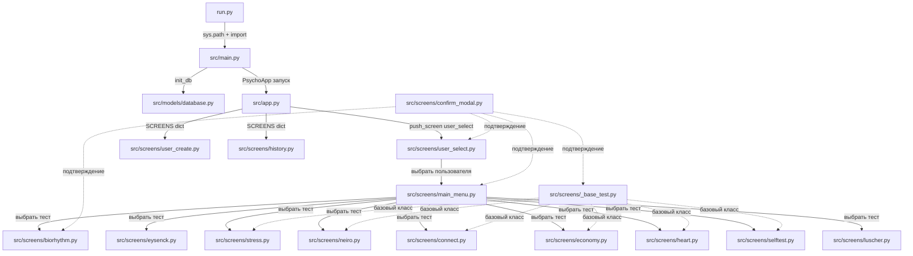
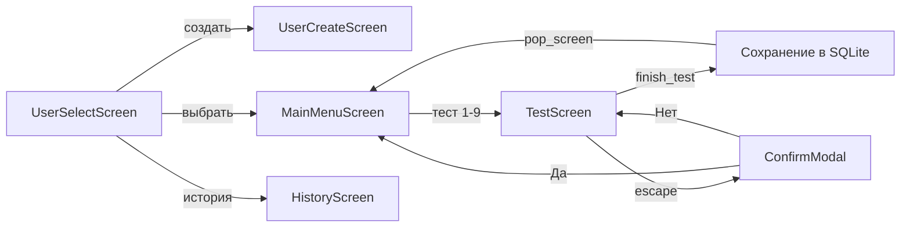
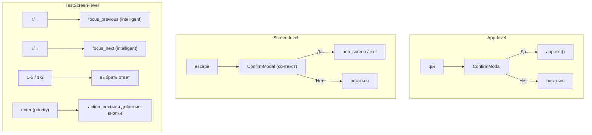
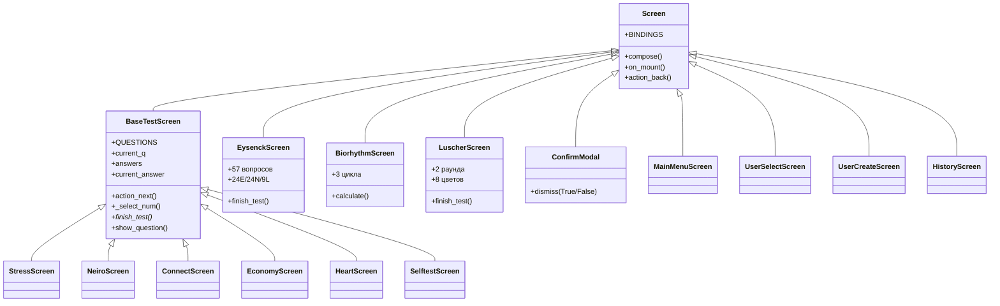
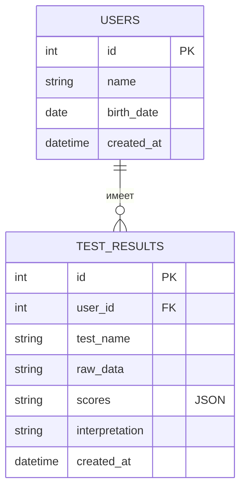
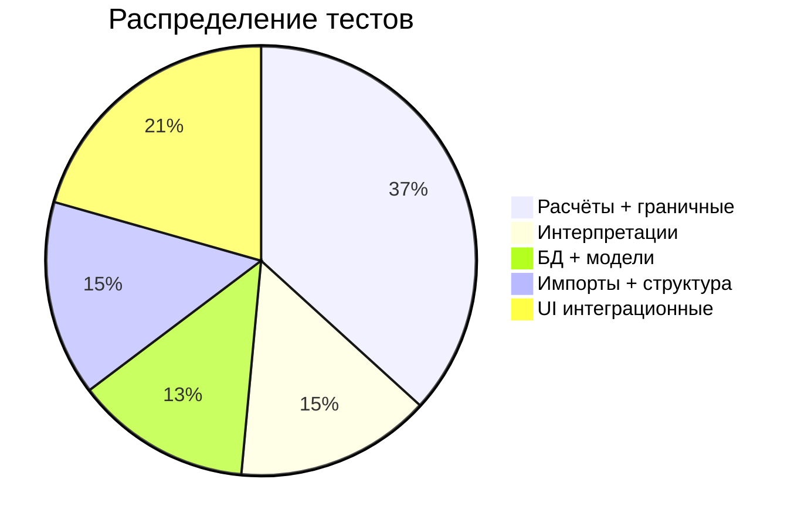

# Разработка TUI-приложения психологических тестов

## 1. Архитектура приложения



## 2. Поток пользователя



## 3. Навигация и клавиши



## 4. Иерархия экранов



## 5. Модели данных



Pydantic-модели:

| Класс | Поля | Назначение |
|-------|------|------------|
| `User` | id, name, birth_date, created_at | Чтение из БД |
| `UserCreate` | name, birth_date | Создание пользователя |
| `TestResult` | id, user_id, test_name, raw_data, scores (`dict[str, Any]`), interpretation, created_at | Чтение из БД |
| `TestResultCreate` | user_id, test_name, raw_data, scores (`dict[str, Any]`), interpretation | Сохранение результата |

## 6. Тесты (9 тестов)

| Тест | Экран | Вопросов | Расчёт | Модуль |
|------|-------|----------|--------|--------|
| Биоритмы | `BiorhythmScreen` | — (расчёт по дате) | sin-циклы 23/28/33 дня | `biorhythm_calc.py` |
| Айзенк EPI | `EysenckScreen` | 57 (24E/24N/9L) | Да/Нет → баллы по шкалам | `eysenck_calc.py` |
| Стресс | `StressScreen` | 24 × Likert 1-5 | Сумма + уровни | `stress_calc.py` |
| Неврология | `NeiroScreen` | 24 × Likert 1-5 | Сумма + уровни | `neiro_calc.py` |
| Совместимость | `ConnectScreen` | 25 × Likert 1-5 | Инвертированные + среднее × 20 | `connect_calc.py` |
| Деловая сфера | `EconomyScreen` | 25 × Likert 1-5 | Инвертированные + среднее × 20 | `economy_calc.py` |
| Сердечно-сосуд. | `HeartScreen` | 25 × Likert 1-5 | 6 шкал (IBC/PPS/DE/AG/NCD/ZM) | `heart_calc.py` |
| Самооценка | `SelftestScreen` | 20 × Likert 1-5 | Инвертированные + среднее × 25 | `selftest_calc.py` |
| Люшер | `LuscherScreen` | 2 раунда × 8 цветов | Тревога/компенсация/активность/работоспособность/вегетатика/консистентность | `luscher_calc.py` |

## 7. Исправленные баги (по аудиту)

| # | Файл | Баг | Исправление |
|---|------|-----|-------------|
| 1 | `history.py:29-41` | `on_mount` sync, `list_view.append()` без `await` → race condition / `DuplicateIds` | `async def on_mount`, `await` для всех `append` |
| 2 | `eysenck.py:152-154` | Мёртвый код: второй `elif event.button.id == "prev_btn"` никогда не выполняется | Удалён |
| 3 | `biorhythm.py` | Результат не сохранялся в БД (в отличие от всех остальных тестов) | Добавлен `save_result` после расчёта |
| 4 | `luscher_calc.py:42` | `list.index(x)` падает если цвет не встречается (дубликаты) | Заменён на `_safe_index` с default 4 |
| 5 | `luscher_calc.py:69` | `choices1.index(1)` падает если цвета 1 нет | Заменён на `_safe_index` |
| 6 | `heart_calc.py:11` | `ZeroDivisionError` при пустом списке ответов для шкалы | Проверка `if not values` |

## 8. Ключевые изменения (хронология)

1. **Reverse-engineering** — анализ 8 COM-бинарников Turbo Pascal, документация в `docs/analysis.md`
2. **Скелет TUI** — Textual App, SCREENS dict, user_select/user_create/main_menu
3. **BaseTestScreen** — общий класс для Likert-тестов (1-5), RadioSet + key_legend + arrow nav
4. **EysenckScreen** — отдельный экран (RadioSet на 2 кнопки, bool-ответы)
5. **Fixed `action_back`** — сделан async, `await action_quit()` вместо прямого `exit()`
6. **RadioSet reset** — `_clear_radio()` через приватные `_pressed_button`/`_selected` с `prevent(Changed)`
7. **Intelligent arrow nav** — RadioSet: стрелки навигация внутри, на границе → `focus_next`/`focus_previous`
8. **Enter key** — `priority=True` на всех тестовых экранах (перехват ДО RadioSet)
9. **`action_next`** — проверка `focused.id == "prev_btn"` → идёт назад
10. **ConfirmModal** — переписан на `Screen` (не `ModalScreen`), CSS самодостаточный
11. **HistoryScreen** — async on_mount, await list_view.append
12. **Biorhythm** — добавлен `save_result`
13. **Luscher** — `_safe_index` защита от ValueError
14. **Heart calc** — защита от `ZeroDivisionError`
15. **scores** — `dict[str, Any]` (был `dict[str, float]`)

## 9. Тестовое покрытие (68 тестов, 0 падений)



## 10. Зависимости

- **textual** ≥ 2.0.0 (фактически 8.2.7) — TUI framework
- **pydantic** ≥ 2.0.0 — модели данных с валидацией
- **rich** ≥ 13.0.0 — форматирование (таблицы, панели)
- **SQLite3** — встроенная БД (без ORM)

## 11. Запуск и тестирование

```bash
# Запуск
venv/bin/python3 run.py

# Тесты
venv/bin/python3 tests.py

# Очистка кэша после изменений
find . -type d -name __pycache__ -exec rm -rf {} + 2>/dev/null
```

Shell пользователя — **fish**; `source venv/bin/activate` не работает. Использовать `venv/bin/python3` напрямую.
