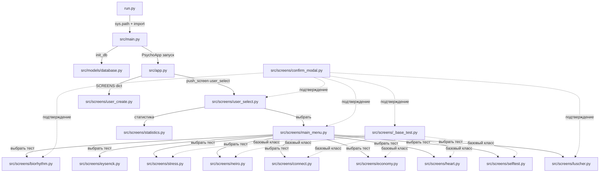
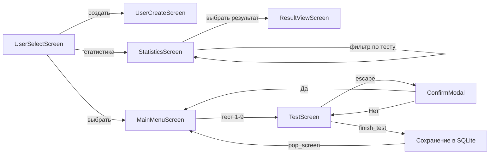
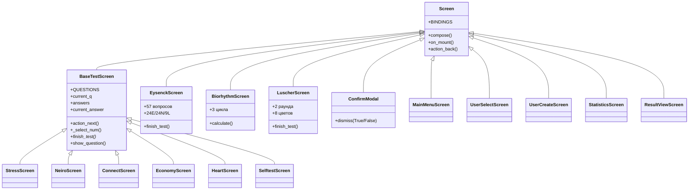
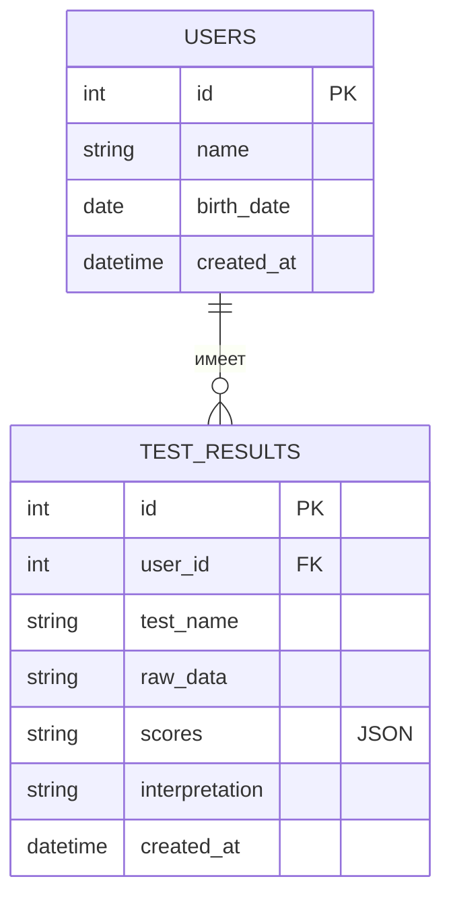
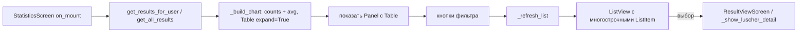
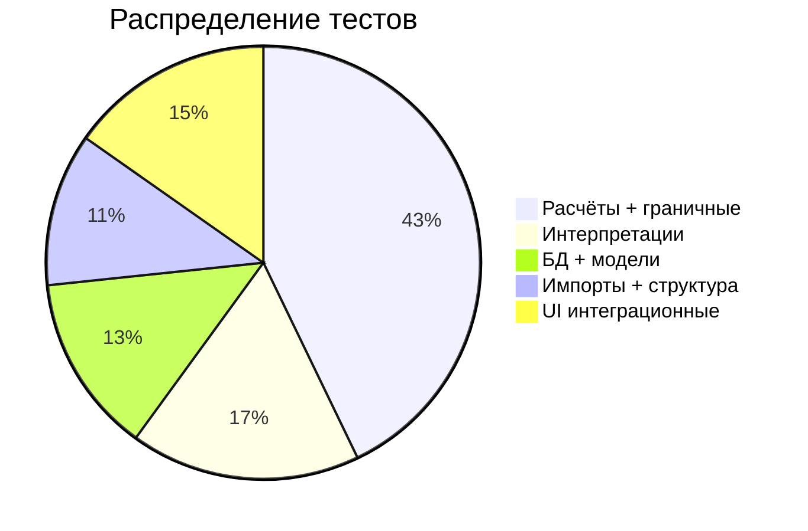

# Разработка TUI-приложения психологических тестов

## 1. Архитектура приложения



## 2. Поток пользователя



## 3. Навигация и клавиши


## 4. Иерархия экранов



## 5. Модели данных



Pydantic-модели:

| Класс | Поля | Назначение |
|-------|------|------------|
| `User` | id, name, birth_date, created_at | Чтение из БД |
| `UserCreate` | name, birth_date | Создание пользователя |
| `TestResult` | id, user_id, test_name, raw_data, scores (`dict[str, Any]`), interpretation, created_at | Чтение из БД |
| `TestResultCreate` | user_id, test_name, raw_data, scores (`dict[str, Any]`), interpretation | Сохранение результата |

## 6. Тесты (9 тестов)

| Тест | Экран | Вопросов | Расчёт | Модуль |
|------|-------|----------|--------|--------|
| Биоритмы | `BiorhythmScreen` | — (расчёт по дате) | sin-циклы 23/28/33 дня | `biorhythm_calc.py` |
| Айзенк EPI | `EysenckScreen` | 57 (24E/24N/9L), shuffled | Да/Нет → баллы по шкалам | `eysenck_calc.py` |
| Стресс | `StressScreen` | 24 × Likert 1-5, shuffled | Сумма + уровни | `stress_calc.py` |
| Неврология | `NeiroScreen` | 24 × Likert 1-5, shuffled | Сумма + уровни | `neiro_calc.py` |
| Совместимость | `ConnectScreen` | 25 × Likert 1-5, shuffled | Инвертированные + среднее × 20 | `connect_calc.py` |
| Деловая сфера | `EconomyScreen` | 25 × Likert 1-5, shuffled | Инвертированные + среднее × 20 | `economy_calc.py` |
| Сердечно-сосуд. | `HeartScreen` | 25 × Likert 1-5, shuffled by scale | 6 шкал (IBC/PPS/DE/AG/NCD/ZM) | `heart_calc.py` |
| Самооценка | `SelftestScreen` | 20 × Likert 1-5, shuffled | Инвертированные + среднее × 25 | `selftest_calc.py` |
| Люшер | `LuscherScreen` | 2 раунда × 8 цветов | Тревога/компенсация/активность/работоспособность/вегетатика/консистентность | `luscher_calc.py` |

## 7. Исправленные баги (по аудиту)

| # | Файл | Баг | Исправление |
|---|------|-----|-------------|
| 1 | `history.py:29-41` | `on_mount` sync, `list_view.append()` без `await` → `DuplicateIds` | `async def on_mount`, `await` для всех `append` |
| 2 | `eysenck.py:152-154` | Мёртвый код: второй `elif event.button.id == "prev_btn"` | Удалён |
| 3 | `biorhythm.py` | Результат не сохранялся в БД | Добавлен `save_result` после расчёта |
| 4 | `luscher_calc.py:42` | `list.index(x)` падает при дубликатах цветов | `_safe_index` с default 4 |
| 5 | `heart_calc.py:11` | `ZeroDivisionError` при пустом списке ответов шкалы | Проверка `if not values` |
| 6 | `database.py` | `DB_PATH` в PyInstaller ведёт в temp | `platformdirs` при `sys.frozen` |
| 7 | `stress/neiro/connect/economy/heart/selftest.py` | Отсутствует `self.test_completed = True` в `finish_test()` | Добавлен флаг |
| 8 | `stress/neiro/connect/economy/selftest.py` | `Static.update()` с Markdown вместо Rich | Заменён на Rich-разметку |
| 9 | `_base_test.py` + `eysenck.py` | `action_next()` и `_select_num()` без guard `test_completed` | Добавлена проверка |
| 10 | `app.tcss` | `#date_label` без `width: 100%` | Добавлен |
| 11 | `luscher.py` | `_rebuild_buttons()` через `remove_children()+mount()` → `DuplicateIds` | In-place style update |
| 12 | `app.py` | `StatisticsScreen` в `SCREENS` dict → кеширование устаревших данных | Удалён из dict, новый instance |

## 8. StatisticsScreen

Экран статистики (заменяет удалённый `history.py`). Показывает:

1. **Информация о пользователе** — имя текущего пользователя или "Все пользователи"
2. **Диаграмма** — горизонтальные баровые графики (Unicode-блоки) с количеством прохождений по каждому тесту и средним баллом
3. **Фильтр по тесту** — кнопки "Все" + по каждому типу теста; фильтрует список результатов
4. **Список результатов** — история с датой, названием и краткой интерпретацией; каждый элемент — `ListItem` с одним `Static` (Rich-разметка, дата+название на первой строке, интерпретация/баллы на второй)
5. **Детали результата** — при выборе элемента открывается `ResultViewScreen` с полными показателями и интерпретацией; для Люшера — таблица цветов через `_show_luscher_detail()`



## 9. Перемешивание вопросов

`shuffle_questions()` в `_base_test.py` — модульная функция. Если передан `key_fn`, группирует по ключу (шкала), сортирует группы по размеру, интерливит — одинаковые шкалы не идут подряд. Без `key_fn` — `random.shuffle`.

- **EysenckScreen**: `self._questions = shuffle_questions(EYSENCK_QUESTIONS, key_fn=lambda q: q[1])`
- **BaseTestScreen**: shuffles `self.QUESTIONS` (и `self.SCALES` если есть) в `on_mount`

## 10. Тестовое покрытие (147 тестов, 0 падений)



## 11. Зависимости

- **textual** 8.x — TUI framework
- **pydantic** ≥ 2.0.0 — модели данных с валидацией
- **rich** ≥ 13.0.0 — форматирование (таблицы, панели)
- **SQLite3** — встроенная БД (без ORM)

## 12. Запуск и тестирование

```bash
# Запуск
./venv/bin/python run.py

# Тесты
./venv/bin/python tests.py

# Очистка кэша после изменений
find . -type d -name __pycache__ -exec rm -rf {} + 2>/dev/null
```

Shell — **fish**; `source venv/bin/activate` не работает. Использовать `venv/bin/python3` напрямую.
